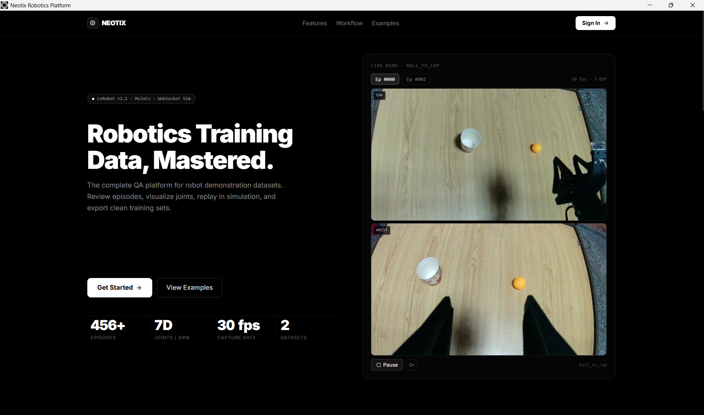
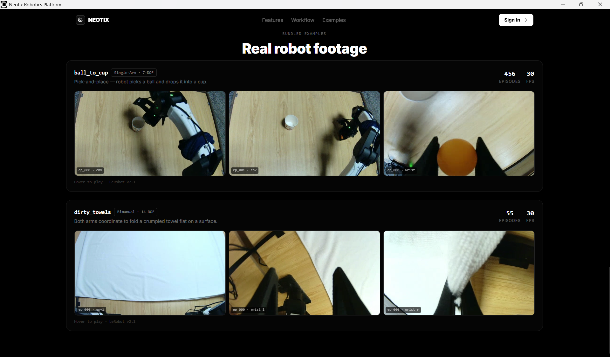
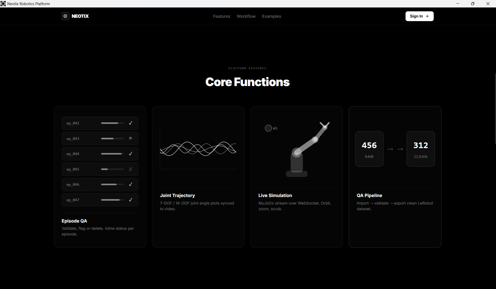
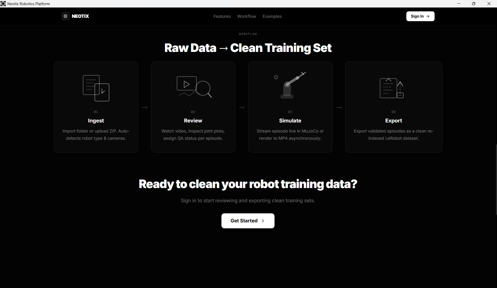
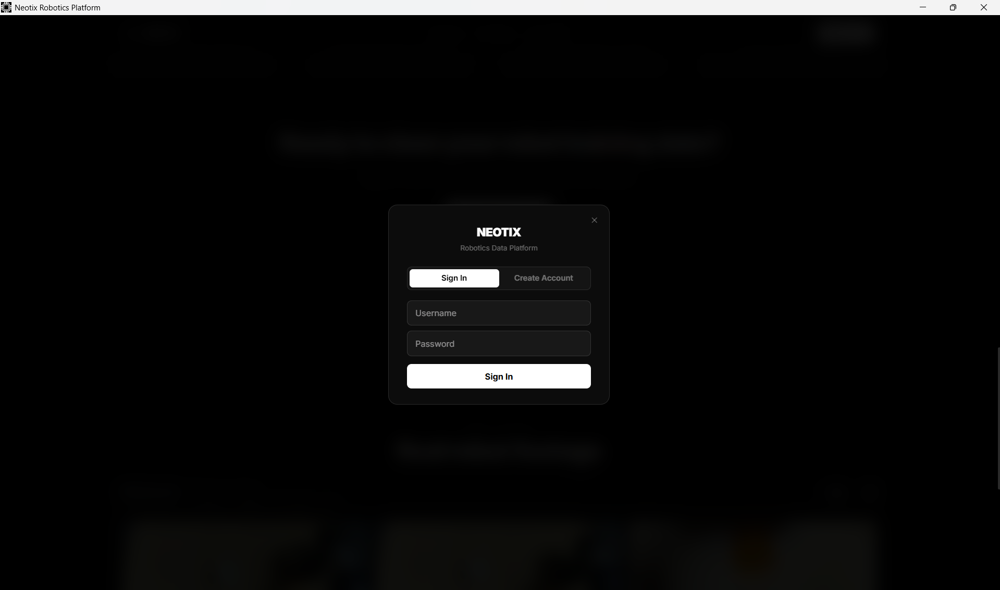
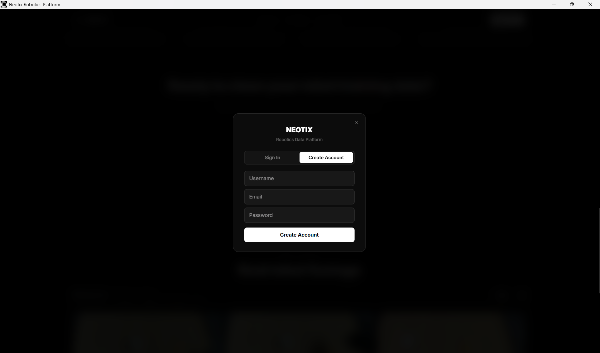

# Neotix Robotics Data Platform

Full-stack web app for browsing, QA-reviewing, merging, and visualizing **LeRobot v2.1** teleoperation datasets (YAM Pro single-arm & bimanual), with a **live MuJoCo simulator**, **async sim-to-MP4 replay**, and optional **Tauri** desktop build.

---

## Overview

Operators manage robotics data through this platform instead of ad-hoc scripts: **JWT auth**, **per-user datasets**, **multi-camera episode playback**, **QA workflows** (validate / flag / delete, task edits, export), **dataset merge** with compatibility checks, **activity audit log**, and **WebSocket**-streamed interactive simulation. Sample datasets are pulled from Hugging Face; MuJoCo models live under `models/i2rt_yam/`.

---

## Tech stack

| Layer                  | Technologies                                                              |
| ---------------------- | ------------------------------------------------------------------------- |
| **Backend**            | FastAPI, Uvicorn, SQLAlchemy, SQLite, JWT (python-jose), passlib/bcrypt   |
| **Data / sim**         | pandas, pyarrow, NumPy, MuJoCo, OpenCV (headless), Hugging Face Hub       |
| **Frontend**           | Vite 6, React 18, TypeScript, React Router 6, TanStack Query, Zustand     |
| **UI**                 | Tailwind CSS v4, Radix UI, shadcn-style components, Framer Motion, Sonner |
| **3D**                 | Three.js, React Three Fiber, Drei, postprocessing                         |
| **Charts**             | Visx, D3                                                                  |
| **Desktop (optional)** | Tauri 2                                                                   |
| **Ops**                | Docker / Docker Compose, nginx (frontend image)                           |

API docs: `http://localhost:8000/docs` (Swagger with **Authorize** for JWT).

---

## Demo

<p align="center">
  <a href="https://drive.google.com/file/d/1mtAfHJZ1t3_Bytw_3suOK1ZMm-92LL7n/view?usp=drive_link">
    
  </a>
</p>

---

## Screenshots

Landing, auth, and marketing sections in a compact **3×2** grid:

<table>
  <tr>
    <td width="33%" valign="top" align="center"><b>Landing</b><br/></td>
    <td width="33%" valign="top" align="center"><b>Examples</b><br/></td>
    <td width="33%" valign="top" align="center"><b>Features</b><br/></td>
  </tr>
  <tr>
    <td valign="top" align="center"><b>Workflow</b><br/></td>
    <td valign="top" align="center"><b>Sign in</b><br/></td>
    <td valign="top" align="center"><b>Sign up</b><br/></td>
  </tr>
</table>

---

## Quick start

```bash
# Backend
python -m venv venv
venv\Scripts\activate          # Windows
pip install -r requirements.txt
uvicorn api.main:app --reload --host 0.0.0.0 --port 8000
```

```bash
# Frontend (new terminal)
cd frontend
npm install
npm run dev
```

Open **`http://localhost:3000`** (or the port Vite prints). For **video/API** features, keep the backend on **port 8000**.

**Optional — Tauri desktop:** `cd frontend && npm run tauri dev` (Rust toolchain required). Ensure the dev server URL in `frontend/src-tauri/tauri.conf.json` matches Vite’s URL if the port is not 3000.

**Optional — Docker:** `docker compose up --build` (see `docker-compose.yml`).

**Sample data:** use `huggingface-cli download` as described in **`SUBMISSION.md`**.

---

## Cloud deployment

- Frontend: Vercel
- Backend: Render free web service
- Database: Neon free Postgres
- Object storage: Cloudflare R2

---

## Repository layout

- **`api/`** — FastAPI app (routers: auth, datasets, episodes, qa, merge, activity, stats, simulator)
- **`frontend/`** — Vite + React SPA; `frontend/src-tauri/` — Tauri shell
- **`tools/`** — Dataset loaders, merge utilities, sim replay helpers
- **`models/i2rt_yam/`** — MuJoCo scenes (single + bimanual)

---

## More detail

Implementation notes, checklist, design decisions, and full run instructions: **`SUBMISSION.md`**.
